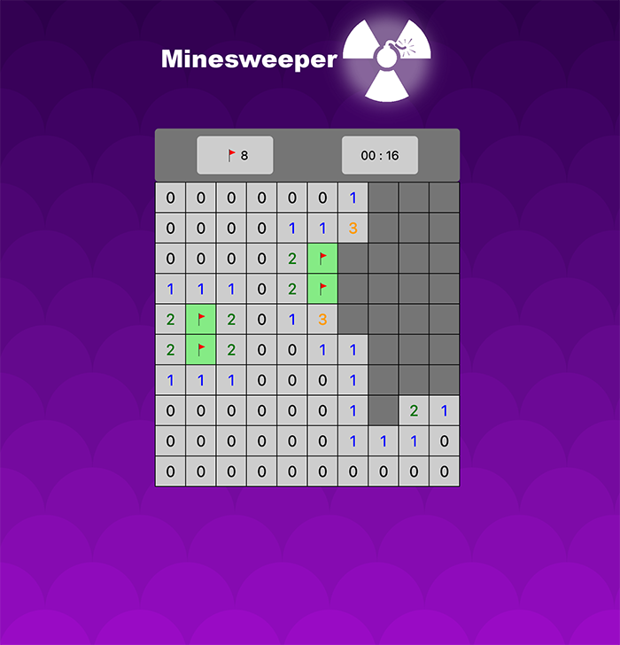

# Minesweeper

Welcome to my `MineSweeper` game. \
The game is made with Angular and Bootstrap. 

# Rules 

- Like Classic minesweeper, the goal is to find **all bombs** position using  **flag** 🏳️
- Max bomb is Half of game cells (ex: 10x10 gamePanel -> max bomb: 50)

# Future update

More challenging game mode to come 😈
 

# How to play ?

Game is accessible from [here](http://chrisdev10.github.io/minesweeper) 🔥

**OR**

Download all the files and run it locally using `ng serve`

# Screenshot

 
 

